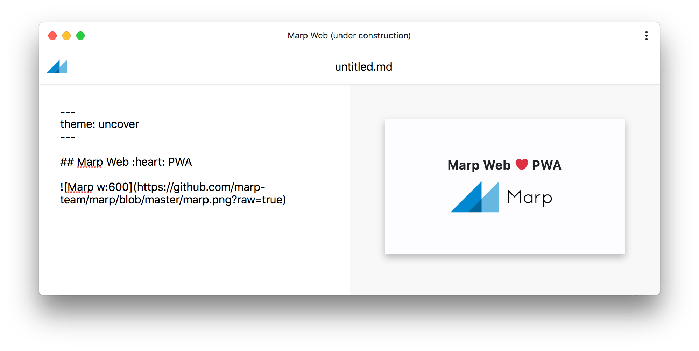

# @marp-team/marp-web

A web interface of Marp.

### :warning: Currently Marp Web is inactive.

> https://web.marp.app/ is a tech demo. In future, we migrate to React app based on our [marp-react](https://github.com/marp-team/marp-react).
>
> We are using [Preact](https://github.com/developit/preact) and it has an advantage to PWA. But I'm not sure to be recieved contributes from community because not of familiar framework. In addition, well-maintained library for React would get better developer experience.

## Desktop PWA

Would you try the future of Marp? By using Chrome's [Desktop PWA](https://developers.google.com/web/progressive-web-apps/desktop), you can use Marp Web as a desktop app like [yhatt/marp](https://github.com/yhatt/marp). Select **"Install Marp..."** from Chrome menu.

Of course, an installed Marp Web works even if the network is offline. (Except external resources in the slide deck)

## Author

Managed by [@marp-team](https://github.com/marp-team).

-  Yuki Hattori ([@yhatt](https://github.com/yhatt))

## License

[MIT License](LICENSE)
